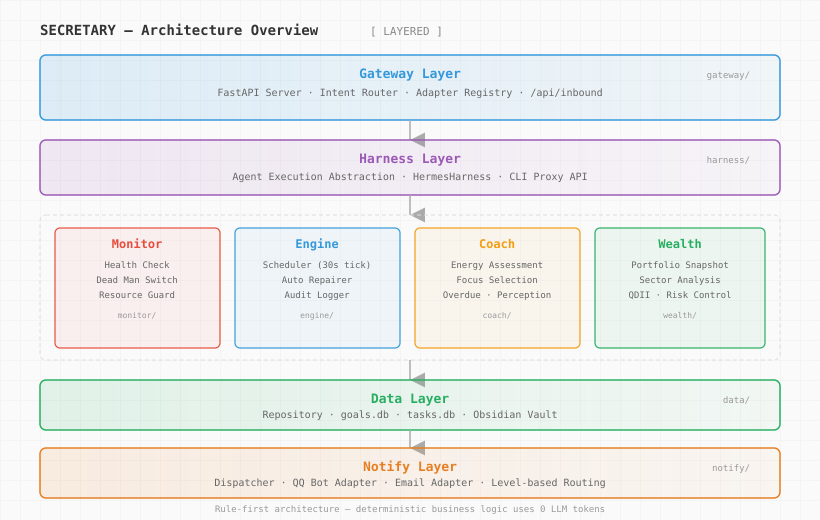
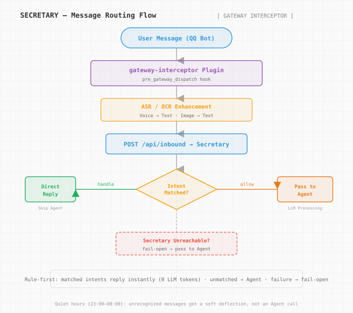

<p align="center">
  
</p>

# Secretary

> **0 LLM tokens · ≈0ms latency · proactive 24/7 · rule-first · humanistic design**
>
> A personal digital assistant daemon that monitors server health, goal progress, and wealth engine — proactively notifying you via QQ and Email. Rules handle deterministic logic; LLM only wakes when rules can't.

<p>
<a href="#core-features"></a>
<a href="#core-features"></a>
<a href="LICENSE"></a>
<a href="https://www.python.org/downloads/"></a>
<a href="#core-features"></a>
</p>

**English** | [简体中文](README.zh-CN.md)

---

## 🎯 Problem it solves

LLM Agents (Hermes / ChatGPT) are powerful but **passive, expensive, and stateless** for everyday tasks. You ask, they reason, they reply — every interaction costs tokens and adds latency. Insights evaporate between sessions.

Secretary flips the model. It's a **cold-first architecture** — rules handle deterministic logic, data accumulates over time, and the system acts **before you ask**.

| Scenario | Pure LLM Agent | Secretary |
|----------|---------------|-----------|
| "What's my todo list?" | LLM reasoning → tokens → 2–5s | Regex match → 0 tokens → <50ms |
| Server disk full | You discover it manually | Auto-detected → alert → auto-repair |
| Morning briefing | You ask daily | Scheduled 08:00 → proactive push |
| Portfolio screenshot | Agent calls vision tool | OCR → intent match → direct reply |
| "What should I focus on?" | LLM guesses from context | Energy algorithm + goal data → data-driven |

**In one sentence:** Secretary handles the 70% of interactions that are deterministic — monitoring, coaching, notifications, quick queries — so the Agent only wakes for the 30% that need real reasoning.

---

## ✨ Core features

<table>
<tr><td><b>≈0 latency</b></td><td>Pure regex + keyword matching, &lt;50ms decision. User feels instant reply.</td></tr>
<tr><td><b>0 token cost</b></td><td>Intent matching calls zero LLM APIs. ASR/OCR only when needed, using the cheapest models.</td></tr>
<tr><td><b>Proactive 24/7</b></td><td>Doesn't wait for questions. Monitors servers, coaches goals, sends morning briefings, alerts on anomalies — all on schedule.</td></tr>
<tr><td><b>Sedimentary intelligence</b></td><td>Gets smarter with use. Cold Skills accumulate from data patterns, not LLM reasoning. The more you use it, the better the focus recommendations.</td></tr>
<tr><td><b>Fail-open</b></td><td>Any component failure → message passes through to Agent. Nothing is ever lost. Secretary is never a bottleneck.</td></tr>
<tr><td><b>Humanistic design</b></td><td>Energy-aware coaching, emotional perception, gentle tone. Detects when you're tired and adjusts. Never nags.</td></tr>
<tr><td><b>Modular</b></td><td>Monitor / Engine / Coach / Wealth / Gateway / Harness layers. Each independent, all optional. Use only what you need.</td></tr>
<tr><td><b>Hermes native</b></td><td>Gateway plugin integration via <a href="https://github.com/petrezhu/secretary-gateway">secretary-gateway</a>. Zero Harness code changes.</td></tr>
</table>

---

## 🧭 Where it sits

| Category | Representative | Characteristic | Relationship with us |
|----------|---------------|----------------|---------------------|
| **Proactive cold agent** | **Secretary (us)** | Rule engine + data accumulation, 0 LLM, proactive | — |
| LLM Agent | Hermes / ChatGPT | Full reasoning, passive, token-heavy | We complement them — simple intents get intercepted |
| Monitoring | Prometheus / Grafana | Metrics + dashboards, reactive alerts | We add proactive notification + auto-repair + coaching |
| Task management | Todoist / TickTick | Task CRUD, manual | We add AI-powered focus selection + overdue detection |
| Personal assistant | Siri / Google Assistant | Voice-first, cloud-dependent | We're local-first, rule-first, zero cloud dependency |
| Workflow platforms | n8n / Dify | Visual orchestration, multi-step | We're a daemon, not a platform — lightweight and focused |

**In one sentence:** We're the proactive layer that sits between you and your Agent — handling the routine so the Agent only handles the hard stuff.

---

## 🏛️ Architecture at a glance



```
secretary/
├── src/secretary/
│   ├── gateway/       ← User interaction entry (FastAPI, intent router)
│   ├── harness/       ← Agent execution engine (HermesHarness)
│   ├── monitor/       ← Server health checks, deadman switch, resource guard
│   ├── engine/        ← Scheduler (30s tick), auto-repairer, audit log
│   ├── coach/         ← Energy assessment, focus selection, morning briefing
│   ├── wealth/        ← Portfolio snapshots, sector analysis, QDII monitoring
│   ├── data/          ← Repository layer (goals.db, tasks.db, Obsidian)
│   ├── notify/        ← Notification dispatch (QQ Bot, Email)
│   └── api/           ← Internal API layer
├── config/            ← default.yaml, morning.yaml templates
├── plugins/           ← Hermes plugins (gateway-interceptor)
├── scripts/           ← systemd service, install script
├── tests/             ← Unit, integration, E2E tests
└── docs/              ← SPEC.md, CONTEXT.md, ADRs
```

---

## 💬 Supported Intents (`/api/inbound`)

Intent definitions in `src/secretary/gateway/intents/`, pure regex matching, zero LLM dependency.
Messages sent to the QQ Bot matching these triggers are replied to directly by Secretary (bypassing the Agent).



| Domain | Trigger Phrases | Response |
|--------|-----------------|----------|
| Help | `有什么指令` / `有什么命令` / `/help` / `帮助` / `你能做什么` | Capability command list |
| Social | `你好` / `谢谢` / `厉害` etc. standalone words | Time-of-day greeting / courtesy |
| Task | `待办` / `有什么任务` (What tasks?) | Active tasks + weekly goal summary |
| Task | `记一下任务：xxx` / `帮我创建任务 xxx` (Create task xxx) | Write to tasks.db, return ticket number |
| Task | `完成#142` / `搞定任务142` (Complete #142) | Mark complete, return ✅ |
| Task | `任务#142` / `查一下#142` (Check #142) | Task details |
| Goal | `今天做什么` / `今日焦点` / `先做哪个` (What to do today?) | Focus goal + next step suggestion |
| Goal | `长期目标` / `年度目标` (Long-term goals) | Goals grouped by domain with progress |
| Goal | `收件箱` / `未处理消息` (Inbox) | Unprocessed inbox entries |
| Wealth | `查一下持仓` / `市值多少` / `盈亏怎么样` (Check portfolio) | Portfolio overview (read-only) |
| Wealth | `大盘` / `行情` / `沪深300` (Market index) | Real-time index movements (Tencent API) |
| Wealth | `qdii` / `溢价` / `套利` (QDII / premium / arbitrage) | Redirects to Agent for full analysis |
| System | `服务器状态` / `内存` / `磁盘` (Server status) | CPU/memory/disk usage |
| System | `清理内存` / `清理进程` / `孤儿进程` (Clean processes) | Auto-detect and clean orphan/leftover processes |
| System | `上次存档` / `checkpoint` | Last archive date and days elapsed |
| System | `早报` / `日报` / `今天安排` (Morning briefing) | Re-send today's morning briefing |
| Emotion | 累了/烦躁 etc. emotional phrases | Soothing reply (perception engine) |

**Quiet hours (23:00–08:00):** Unrecognized ordinary messages don't disturb the Agent; Secretary replies with "Not bothering with this now, will look again tomorrow morning." Other messages still fail-open to the Agent as usual.

**Design principle:** Only answer intents backed by real data. When data is missing or external APIs fail, always pass through to the Agent. All wealth intents are read-only — no trade execution.

---

## 🚀 Quick Start

```bash
git clone https://github.com/petrezhu/secretary.git
cd secretary

# Install (development mode)
pip install -e ".[dev]"

# Configure
cp .env.example .env  # edit with your config

# Run checks
secretary check

# Start daemon
secretary start

# Stop daemon
secretary stop
```

### systemd Deployment

```bash
sudo cp scripts/secretary.service /etc/systemd/system/
sudo systemctl daemon-reload
sudo systemctl enable --now secretary

# View logs
journalctl -u secretary -f
```

---

## ⚙️ Configuration

Secretary uses environment variables for all personal configuration. First-time setup:

```bash
cp .env.example .env
# Edit .env with your actual values
```

Key environment variables:

| Variable | Description | Required |
|----------|-------------|----------|
| `SECRETARY_DATA_DIR` | Hermes workspace data directory | ✅ |
| `SECRETARY_USER_NAME` | What Secretary calls you | No (default "主人") |
| `SECRETARY_PORTFOLIO_PATH` | Portfolio data file path | Required for wealth features |
| `SMTP_USER` / `SMTP_PASSWORD` | Email notification config | Required for email |
| `QQ_APP_ID` / `QQ_CLIENT_SECRET` | QQ Bot config | Required for QQ |

### Local Configuration (not in git)

Besides `.env`, Secretary automatically merges two optional local config files at runtime (effective if present, silently skipped if missing or malformed — does not affect startup):

| File | Purpose |
|------|---------|
| `config/local.json` | Personal self-hosted system list (merged into system list intent) |
| `config/local_stocks.json` | Personal stock/fund name patterns (entity recognition + sector keywords) |

Both are excluded in `.gitignore` and will never enter version history. Format:

```jsonc
// config/local.json
{
  "systems": [
    {"name": "MyService", "description": "...", "location": "/opt/...",
     "commands": {"status": "..."}, "port": 8080, "notes": "..."}
  ]
}

// config/local_stocks.json
{
  "stock_patterns": [{"pattern": "(StockA|Ticker1)"}],
  "sector_overrides": {"Tech Growth": {"extra_keywords": ["StockA"]}}
}
```

---

<details>
<summary><b>Deep dive — module details (for developers taking over this repo)</b></summary>

### monitor/ — Monitor Layer

| Module | Function |
|--------|----------|
| `health.py` | System health check (memory/CPU/disk/service status) |
| `deadman.py` | Dead man's switch — detects whether the target system is still running |
| `resource_guard.py` | Resource guard — exponential backoff on threshold breach (600s→1200s→…→9600s) |

### engine/ — Engine Layer

| Module | Function |
|--------|----------|
| `scheduler.py` | Task scheduler, 30s tick interval, manages Job queue |
| `repairer.py` | Auto-repairer — service_down/docker_down/disk_full/cron_stuck |
| `audit.py` | Audit log, records all operations to audit.jsonl |

### coach/ — Coach Layer

| Module | Function |
|--------|----------|
| `energy.py` | User energy state assessment (high/medium/low) |
| `focus.py` | Today's focus selection algorithm |
| `overdue.py` | Overdue goal detection and severity assessment |
| `perception.py` | Perception engine — emotion and urgency inference |
| `planner.py` | Adaptive plan adjustment (PlanAdjustment) |
| `morning.py` | Morning briefing generator, selects sign-off based on energy state |

### wealth/ — Wealth Engine

| Module | Function |
|--------|----------|
| `portfolio.py` | Portfolio snapshot (PortfolioSnapshot) — total market value, P&L, notable changes |
| `sector_analysis.py` | Sector analysis — 8 sectors + 52-week + beta coefficient |
| `national_team.py` | National team fund signals (northbound/southbound/ETF inflows) |
| `eastmoney_sync.py` | EastMoney CDP data sync (passive keep-alive, 2h) |
| `decision.py` | Investment decision engine |
| `risk.py` | Risk control module |
| `qdii.py` | QDII fund monitoring |
| `redemption.py` | Redemption analysis |
| `monitor.py` | Individual stock keyword monitoring |
| `jobs.py` | Wealth engine scheduled task collection |

### gateway/ — User Interaction Entry

| Module | Function |
|--------|----------|
| `server.py` | FastAPI gateway service, port 8901 |
| `api.py` | API route definitions |
| `inbound.py` | `/api/inbound` intent router — direct reply for simple intents, pass to Agent for complex queries |
| `adapters.py` | Adapter protocol (GatewayAdapter) and registry (AdapterRegistry) |

### harness/ — Agent Execution Engine

| Module | Function |
|--------|----------|
| `base.py` | BaseHarness base class — connection/timeout/error handling |
| `hermes.py` | HermesHarness — integrates with Hermes Agent (CLI Proxy API) |
| `registry.py` | Harness registry, selects engine by name |

</details>

---

## 🛠️ Tech Stack

| Layer | Technology |
|-------|-----------|
| Language | Python ≥3.10 (hatchling build) |
| Web | FastAPI + Uvicorn |
| Monitoring | psutil |
| Configuration | PyYAML + python-dotenv |
| Testing | pytest + pytest-asyncio + pytest-cov |
| Linting | ruff |

---

## 📚 Documentation

- [SPEC.md](docs/SPEC.md) — System specification (thresholds/scheduling/repair/notifications)
- [CONTEXT.md](docs/CONTEXT.md) — Glossary (data structure definitions for each module)
- [ADR](docs/adr/) — Architecture decision records
- [secretary-gateway](https://github.com/petrezhu/secretary-gateway) — The message interception plugin (separate open-source repo)

---

## 📄 License

[MIT](LICENSE)
