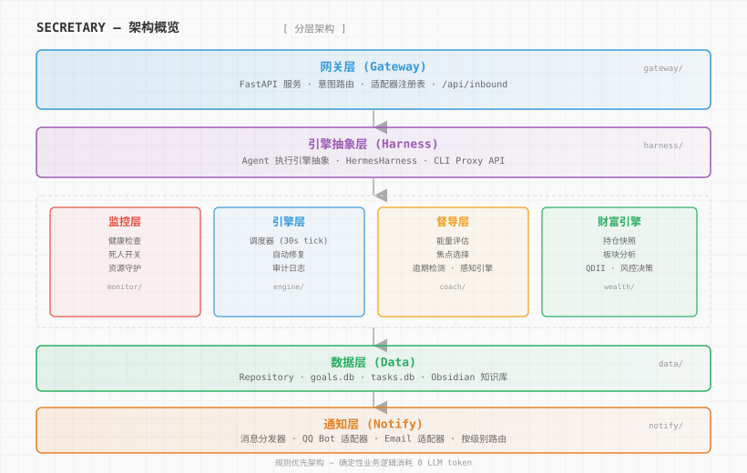
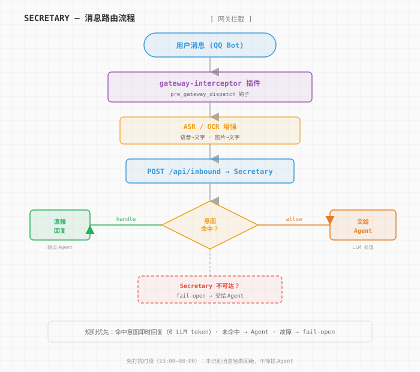

# Secretary — 个人数字助理系统

[English](README.md) | **简体中文**

<p align="center">
  
</p>

<p align="center">
<a href="#核心特性"></a>
<a href="#核心特性"></a>
<a href="#核心特性"></a>
<a href="LICENSE"></a>
<a href="https://www.python.org/downloads/"></a>
<a href="#核心特性"></a>
</p>

> 7×24 常驻守护进程：监控服务器健康、目标进度、知识库、财富引擎——主动通过 QQ 和邮件推送消息。

---

## 解决什么问题

| | 纯 LLM Agent | 规则优先 | Secretary（沉淀式智能） |
|---|---|---|---|
| **决策方式** | 每次都问模型 | if/else | 规则处理简单意图，LLM 处理复杂推理 |
| **可靠性** | 模型幻觉/超时 | 刚性 | 规则兜底 + LLM 弹性 |
| **成本** | 高（每次推理付费） | 零 | 80% 免费，20% LLM |
| **主动性** | 无 | 定时 | **主动式**——不等提问，主动推送 |
| **故障模式** | 挂死 | 粗暴 | **故障开放**——简单意图出错，复杂请求照常传给 Agent |
| **人格温度** | 无 | 冰冷 | **人文设计**——问候、安抚、能量感知签收 |

## 核心特性

| 特性 | 说明 |
|------|------|
| 🖥️ **服务器监控** | 内存/CPU/磁盘阈值报警、服务存活检查、自动修复 |
| 🎯 **目标教练** | 逾期目标检测、能量状态评估、每日焦点推荐、自适应计划调整 |
| 💰 **财富引擎** | A 股持仓快照、行业分析、国家队信号、QDII 监控、风控决策 |
| 📬 **通知分发** | QQ Bot + 邮件双通道，按严重度分级（INFO/WARNING/CRITICAL） |
| ☀️ **早报** | 每日 08:00 推送：今日重点、待办事项、卡壳目标、昨日完成 |
| 🤖 **Hermes 集成** | 通过 Gateway 插件拦截 QQ 消息；简单意图直接回复，复杂查询转发 Agent |

## 产品定位

Secretary 是一个**主动式**个人助理——不等提问，持续监控指标，在合适时机推送通知：

- **消息入口**：QQ Bot 消息 → `/api/inbound` → 意图路由
- **决策分层**：简单意图（问候/待办/持仓）→ 直接回复；复杂意图（分析/推理）→ 转 Agent
- **故障开放**：Secretary 不可达时，消息照常转发 Agent，不阻断
- **沉淀式**：规则先行，LLM 处理规则无法覆盖的边界情况

## 架构一览



```
┌─────────────────────────────────────────────────────┐
│                   Secretary 守护进程                  │
│                                                     │
│  ┌──────────┐  ┌──────────┐  ┌──────────┐          │
│  │ monitor/ │  │ engine/  │  │ coach/   │          │
│  │ 健康检查  │  │ 调度引擎  │  │ 目标教练  │          │
│  └──────────┘  └──────────┘  └──────────┘          │
│                                                     │
│  ┌──────────┐  ┌──────────┐  ┌──────────┐          │
│  │ wealth/  │  │ gateway/ │  │ harness/ │          │
│  │ 财富引擎  │  │ 网关层    │  │ Agent 引擎│          │
│  └──────────┘  └──────────┘  └──────────┘          │
│                                                     │
│  ┌──────────┐  ┌──────────┐                         │
│  │ notify/  │  │ data/    │                         │
│  │ 通知层    │  │ 数据层    │                         │
│  └──────────┘  └──────────┘                         │
└─────────────────────────────────────────────────────┘
```

## 支持的意图



意图定义位于 `src/secretary/gateway/intents/`，纯正则匹配，无 LLM 依赖。
发送给 QQ Bot 的消息匹配以下触发词时，由 Secretary 直接回复（绕过 Agent）：

| 领域 | 触发词 | 回复内容 |
|------|--------|----------|
| 帮助 | `有什么指令` / `有什么命令` / `/help` / `帮助` / `你能做什么` | 能力指令列表 |
| 社交 | `你好` / `谢谢` / `厉害` 等独立词语 | 按时段问候 / 客气回复 |
| 任务 | `待办` / `有什么任务` | 活跃任务 + 本周目标摘要 |
| 任务 | `记一下任务：xxx` / `帮我创建任务 xxx` | 写入 tasks.db 并返回工单号 |
| 任务 | `完成#142` / `搞定任务142` | 标记完成并返回 ✅ |
| 任务 | `任务#142` / `查一下#142` | 任务详情 |
| 目标 | `今天做什么` / `今日焦点` / `先做哪个` | 焦点目标 + 下一步建议 |
| 目标 | `长期目标` / `年度目标` | 按领域分组的目标及进度 |
| 目标 | `收件箱` / `未处理消息` | 未处理的收件箱条目 |
| 财富 | `查一下持仓` / `市值多少` / `盈亏怎么样` | 持仓概览（只读） |
| 财富 | `大盘` / `行情` / `沪深300` | 实时指数行情（腾讯 API） |
| 财富 | `qdii` / `溢价` / `套利` | 转发 Agent 进行完整分析 |
| 系统 | `服务器状态` / `内存` / `磁盘` | CPU/内存/磁盘用量 |
| 系统 | `清理内存` / `清理进程` / `孤儿进程` | 自动检测并清理孤儿/重复/残留进程 |
| 系统 | `上次存档` / `checkpoint` | 上次存档日期和距今天数 |
| 系统 | `早报` / `日报` / `今天安排` | 重发今日早报 |
| 情绪 | 累了/烦躁等情绪短语 | 安抚回复（感知引擎） |

**静默时段（23:00–08:00）：** 无法识别的普通消息不打扰 Agent，回复"现在不打扰了，明早再看。"其他消息照常故障开放转发 Agent。

**设计原则：** 仅在有真实数据支撑时回复意图；数据缺失或外部 API 故障时，始终转发 Agent。所有财富意图均为只读——不执行交易。

## 快速开始

```bash
cd secretary

# 安装（开发模式）
pip install -e ".[dev]"

# 运行检查
secretary check

# 启动守护进程
secretary start

# 停止守护进程
secretary stop
```

### systemd 部署

```bash
sudo cp scripts/secretary.service /etc/systemd/system/
sudo systemctl daemon-reload
sudo systemctl enable --now secretary

# 查看日志
journalctl -u secretary -f
```

### 运行时阈值

| 资源 | 默认阈值 | 说明 |
|------|----------|------|
| 内存 | 95% | memory_percent |
| CPU | 95% | cpu_percent（5 分钟平均） |
| 磁盘 | 95% | disk_percent |

### 通知规则

| 级别 | 通道 | 行为 |
|------|------|------|
| CRITICAL | QQ | 即时推送 |
| WARNING | QQ | 批量推送，最多 5 条/小时 |
| INFO | QQ | 定时推送，每日 08:00 |

## 配置

Secretary 使用环境变量进行所有个人配置。首次设置：

```bash
cp .env.example .env
# 编辑 .env 填入实际值
```

关键环境变量：

| 变量 | 说明 | 必填 |
|------|------|------|
| `SECRETARY_DATA_DIR` | Hermes 工作空间数据目录 | ✅ |
| `SECRETARY_USER_NAME` | Secretary 对你的称呼 | 否（默认"主人"） |
| `SECRETARY_PORTFOLIO_PATH` | 持仓数据文件路径 | 财富功能必填 |
| `SMTP_USER` / `SMTP_PASSWORD` | 邮件通知配置 | 邮件必填 |
| `QQ_APP_ID` / `QQ_CLIENT_SECRET` | QQ Bot 配置 | QQ 必填 |

### 本地配置（不在 git 中）

除 `.env` 外，Secretary 启动时自动合并两个可选本地配置文件
（存在则生效，缺失或格式错误时静默跳过——不影响启动）：

| 文件 | 用途 |
|------|------|
| `config/local.json` | 个人自托管系统列表（合并入系统列表意图） |
| `config/local_stocks.json` | 个人股票/基金名称模式（实体识别 + 行业关键词） |

两者均已排除在 `.gitignore` 中，不会进入版本历史。格式：

```jsonc
// config/local.json
{
  "systems": [
    {"name": "MyService", "description": "...", "location": "/opt/...",
     "commands": {"status": "..."}, "port": 8080, "notes": "..."}
  ]
}

// config/local_stocks.json
{
  "stock_patterns": [{"pattern": "(StockA|Ticker1)"}],
  "sector_overrides": {"Tech Growth": {"extra_keywords": ["StockA"]}}
}
```

## 模块详解

<details>
<summary><strong>monitor/ — 监控层</strong></summary>

| 模块 | 功能 |
|------|------|
| `health.py` | 系统健康检查（内存/CPU/磁盘/服务状态） |
| `deadman.py` | 死信开关——检测目标系统是否仍在运行 |
| `resource_guard.py` | 资源守卫——阈值突破时指数退避（600s→1200s→…→9600s） |

</details>

<details>
<summary><strong>engine/ — 引擎层</strong></summary>

| 模块 | 功能 |
|------|------|
| `scheduler.py` | 任务调度器，30 秒心跳间隔，管理 Job 队列 |
| `repairer.py` | 自动修复器——service_down/docker_down/disk_full/cron_stuck |
| `audit.py` | 审计日志，所有操作记录到 audit.jsonl |

</details>

<details>
<summary><strong>coach/ — 教练层</strong></summary>

| 模块 | 功能 |
|------|------|
| `energy.py` | 用户能量状态评估（high/medium/low） |
| `focus.py` | 今日焦点选择算法 |
| `overdue.py` | 逾期目标检测与严重度评估 |
| `perception.py` | 感知引擎——情绪与紧迫度推断 |
| `planner.py` | 自适应计划调整（PlanAdjustment） |
| `morning.py` | 早报生成器，根据能量状态选择签收语 |

</details>

<details>
<summary><strong>wealth/ — 财富引擎</strong></summary>

| 模块 | 功能 |
|------|------|
| `portfolio.py` | 持仓快照（PortfolioSnapshot）——总市值、盈亏、显著变动 |
| `sector_analysis.py` | 行业分析——8 大行业 + 52 周 + beta 系数 |
| `national_team.py` | 国家队基金信号（北向/南向/ETF 资金流入） |
| `eastmoney_sync.py` | 东方财富 CDP 数据同步（被动保活，2 小时） |
| `decision.py` | 投资决策引擎 |
| `risk.py` | 风控模块 |
| `qdii.py` | QDII 基金监控 |
| `redemption.py` | 赎回分析 |
| `monitor.py` | 个股关键词监控 |
| `jobs.py` | 财富引擎定时任务集合 |

</details>

<details>
<summary><strong>gateway/ — 用户交互入口</strong></summary>

| 模块 | 功能 |
|------|------|
| `server.py` | FastAPI 网关服务，端口 8901 |
| `api.py` | API 路由定义 |
| `inbound.py` | `/api/inbound` 意图路由器——简单意图直接回复，复杂查询转发 Agent |
| `adapters.py` | 适配器协议（GatewayAdapter）和注册表（AdapterRegistry） |

</details>

<details>
<summary><strong>harness/ — Agent 执行引擎</strong></summary>

| 模块 | 功能 |
|------|------|
| `base.py` | BaseHarness 基类——连接/超时/错误处理 |
| `hermes.py` | HermesHarness——集成 Hermes Agent（CLI Proxy API） |
| `registry.py` | Harness 注册表，按名称选择引擎 |

</details>

## 技术栈

- **语言**：Python ≥3.9（hatchling 构建）
- **Web**：FastAPI + Uvicorn
- **监控**：psutil
- **配置**：PyYAML
- **测试**：pytest + pytest-asyncio + pytest-cov
- **Lint**：ruff

## 文档

- [SPEC.md](docs/SPEC.md) — 系统规范（阈值/调度/修复/通知）
- [CONTEXT.md](docs/CONTEXT.md) — 术语表（各模块数据结构定义）
- [ADR](docs/adr/) — 架构决策记录
